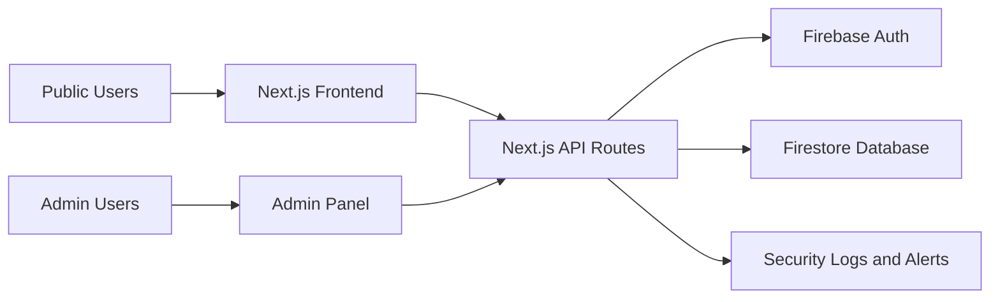

<div align="center">
  
</div>

<div align="center">
  
</div>

<div align="center">
  <a href="https://kibahascouts.vercel.app"></a>
  
  
  
  
</div>

---

## Overview

**Kibaha Scouts Website** is the official web platform for Kibaha District Scouts.  
It centralizes district communication through verified news, event publishing, resource sharing, contact workflows, and a protected admin CMS.

## Preview

<table>
  <tr>
    <td></td>
    <td></td>
  </tr>
  <tr>
    <td align="center"><strong>Homepage Experience</strong></td>
    <td align="center"><strong>News and Community Stories</strong></td>
  </tr>
</table>

## Platform Highlights

| Module | Description |
| --- | --- |
| Public Website | Newsroom, Events, Resources, About, Programmes, Contact |
| Admin CMS | Create, edit, publish, unpublish, and delete content |
| Access Control | Role-based permissions (`super_admin`, `content_admin`, `viewer`) |
| Security Layer | Session tracking, login attempt limits, audit logs, block rules |
| Media Support | Video/gallery entries with embed-ready links |
| Deployment | Optimized for Vercel + Firebase backend services |

## Architecture



## Main Routes

| Area | Route |
| --- | --- |
| Home | `/` |
| Newsroom | `/newsroom` |
| Events | `/events` |
| Resources | `/resources` |
| Admin Login | `/admin/login` |
| Admin Registration (Invited Admins) | `/admin/register` |
| Admin Dashboard | `/admin` |
| Security Center | `/admin/security` |

## Local Development

```bash
npm install
npm run dev
```

Build check:

```bash
npm run build
```

## Firebase Setup

1. Create Firebase project.
2. Enable `Email/Password` in Authentication.
3. Create Firestore in Native mode.
4. Deploy repo Firestore config:

```bash
firebase login
firebase use <your-project-id>
firebase deploy --only firestore:rules,firestore:indexes
```

5. Copy `.env.example` to `.env.local` and fill all required variables.
6. Add admin records in `adminUsers` collection.

## Admin Onboarding Flow

1. Super admin allowlists admin email in `adminUsers`.
2. Invited admin opens `/admin/register` to set password once.
3. Admin logs in normally at `/admin/login` afterward.

## Vercel Deployment

1. Import this repository in Vercel.
2. Add all environment variables to Production and Preview.
3. Redeploy whenever environment values change.

## Developer Credit

Special thanks to **Eliahhango** for the development, architecture decisions, implementation, and continuous platform improvement.

Developer profiles:

- GitHub: [github.com/Eliahhango](https://github.com/Eliahhango)
- LinkedIn: [linkedin.com/in/eliahhango](https://www.linkedin.com/in/eliahhango/)
- Website: [elitechwiz.site](https://www.elitechwiz.site)
- YouTube: [youtube.com/@eliahhango](https://youtube.com/@eliahhango)

<div align="center">
  
</div>
